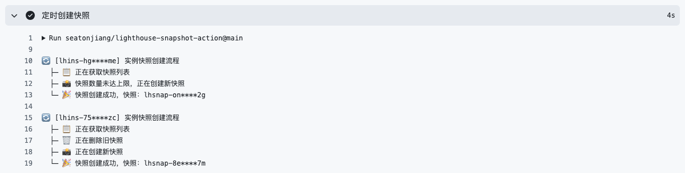

# Lighthouse Snapshot Action

使用 GitHub Action 定时创建腾讯云轻量应用服务器快照



## 🚀 用法示例

创建一个定时任务，北京时间每天 2 点自动执行，支持手动执行。

```yaml
name: "定时创建快照"

on:
  schedule:
    - cron: "0 18 * * *"
  workflow_dispatch:

jobs:
  create-snapshot:
    name: "定时创建快照"
    runs-on: ubuntu-latest

    steps:
      - name: "定时创建快照"
        uses: seatonjiang/lighthouse-snapshot-action@main
        with:
          secret_id: ${{ secrets.TENCENTCLOUD_SECRETID }}
          secret_key: ${{ secrets.TENCENTCLOUD_SECRETKEY }}
          region_instance: ${{ secrets.TENCENTCLOUD_REGIONINSTANCE }}
          snapshot_mode: loop
```

> 提示：`secret_id`、`secret_key`、`region_instance` 需要使用 GitHub Secrets 存储，避免明文暴露在代码中。

## 📚 参数说明

| 参数 | 是否必填 | 描述 |
| :---: | :---: | ---- |
| `secret_id` | 是 | 腾讯云 SecretID，可以在「[腾讯云 - 访问管理](https://console.cloud.tencent.com/cam/overview)」中创建获取，建议使用子账号密钥 |
| `secret_key` | 是 | 腾讯云 SecretKey，可以在「[腾讯云 - 访问管理](https://console.cloud.tencent.com/cam/overview)」中创建获取，建议使用子账号密钥 |
| `region_instance` | 是 | 地域和实例组（支持多个实例，每个实例之间用英文逗号隔开），格式为 `ap-beijing:lhins-xxxx` |
| `snapshot_mode` | 是 | 快照模式，可选值为 `loop`（循环，保留 2 个自动创建的快照）或 `fixed`（固定，保留 1 个手动创建的快照和 1 个自动创建的快照） |

> 提示：腾讯云密钥建议使用子账号密钥，只需为子账号分配 `QcloudLighthouseFullAccess` 策略。

## 💖 项目支持

如果这个项目为你带来了便利，请考虑为这个项目点个 Star 或者通过微信赞赏码支持我，每一份支持都是我持续优化和添加新功能的动力源泉！

<div align="center">
    <b>微信赞赏码</b>
    <br>
    
</div>

## 🤝 参与共建

我们欢迎所有的贡献，你可以将任何想法作为 [Pull Requests](https://github.com/seatonjiang/lighthouse-snapshot-action/pulls) 或 [Issues](https://github.com/seatonjiang/lighthouse-snapshot-action/issues) 提交。

## 📃 开源许可

项目基于 MIT 许可证发布，详细说明请参阅 [LICENSE](https://github.com/seatonjiang/lighthouse-snapshot-action/blob/main/LICENSE) 文件。
